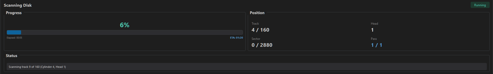

# Scanning Disks

This guide covers scanning floppy disks with Floppy Disk Workbench, including understanding results and troubleshooting common issues.

## Table of Contents

- [What is Scanning?](#what-is-scanning)
- [Before You Scan](#before-you-scan)
- [Running a Scan](#running-a-scan)
- [Understanding Results](#understanding-results)
- [Advanced Scanning](#advanced-scanning)
- [Troubleshooting Scan Issues](#troubleshooting-scan-issues)

---

## What is Scanning?

Scanning reads all sectors on a floppy disk to assess its condition. During a scan, Floppy Disk Workbench:

1. Captures raw flux data from each track using the Greaseweazle
2. Decodes MFM/FM data to extract sectors
3. Validates CRC checksums for data integrity
4. Records signal quality metrics
5. Updates the circular sector map in real-time

The scan results help you:

- **Assess disk health** — Identify good, bad, and weak sectors
- **Visualize damage patterns** — See physical damage distribution on the sector map
- **Prepare for recovery** — Identify which sectors need recovery attempts
- **Verify data integrity** — Confirm CRC checksums are valid

---

## Before You Scan

### Prerequisites

Before scanning, ensure:

- Greaseweazle is connected and detected (green indicator in Drive Control Panel)
- Floppy drive is connected and calibrated
- Disk is inserted in the drive
- Correct disk format is selected in the Session system

### Disk Inspection

Inspect the disk before scanning:

- **Mold or debris** — Clean carefully before inserting, or the disk may damage the drive heads
- **Physical damage** — Scratches or warping may cause read failures
- **Metal shutter** — Verify it moves freely and springs back
- **Hub ring** — Check for cracks that could cause the disk to jam

### Drive Preparation

For best results:

1. Calibrate the drive first (Drive Control Panel > Calibrate button)
2. Allow the drive motor to stabilize (RPM should settle around 300)
3. Clean drive heads if you experience unexplained read failures

---

## Running a Scan

### Starting the Scan

Scanning is straightforward:

1. Insert a disk into the drive
2. Click **Scan** in the Operation Toolbar

The scan begins immediately and progress is displayed in the **Progress** tab at the bottom of the window.

### Monitoring Progress

During the scan, the Progress tab shows real-time information:

*Screenshot: Progress tab showing scan in progress with statistics*

| Element | Description |
|---------|-------------|
| **Circular Sector Map** | Real-time visualization of sector status as each track is read |
| **Progress Bar** | Overall scan completion percentage |
| **Sector Counter** | Current sector / total sectors (e.g., "1672 / 2880") |
| **Good Count** | Number of sectors read successfully |
| **Bad Count** | Number of sectors with errors |
| **Elapsed Time** | Time since scan started (MM:SS) |
| **ETA** | Estimated time remaining |

The sector map updates in real-time as each sector is decoded, with colors indicating status.

### Canceling a Scan

To cancel a scan in progress:

1. Click the **Cancel** button in the Progress tab
2. Confirm cancellation when prompted

Partial results from a canceled scan are preserved and displayed in the sector map.

### Scan Completion

When the scan finishes:

- A completion sound plays (if sound is enabled in settings)
- The progress bar turns green
- **View Report** and **Done** buttons appear
- Full results are available in the Analytics Panel tabs

---

## Understanding Results

### Sector Status Colors

The circular sector map uses colors to indicate sector status:

| Color | Status | Description |
|-------|--------|-------------|
| Green | Good | Sector read successfully, CRC valid |
| Red | Bad | CRC error or sector unreadable |
| Yellow | Weak | Read successfully but marginal signal quality |
| Purple | Missing | Sector header not found on track |
| Gray | No Data | No valid data pattern detected |
| Orange | Recovered | Previously bad sector recovered (after recovery operation) |

### Statistics Panel

After scanning, the Summary tab in the Analytics Panel shows:

| Statistic | Description |
|-----------|-------------|
| **Total Sectors** | Number of sectors on the disk (e.g., 2880 for 1.44MB) |
| **Good Sectors** | Successfully read sectors |
| **Bad Sectors** | Failed sectors requiring recovery |
| **Health Percentage** | Ratio of good sectors to total |
| **Scan Duration** | Total time elapsed |

### Signal Quality

Each sector has a signal quality score from 0% to 100%:

| Range | Quality | Interpretation |
|-------|---------|----------------|
| 90-100% | Excellent | Strong, clear signal suitable for archiving |
| 70-89% | Good | Normal condition, reliable reads |
| 50-69% | Fair | Aging media, may degrade over time |
| 30-49% | Poor | At risk of failure, consider backup now |
| 0-29% | Critical | Recovery may not be possible |

---

## Advanced Scanning

### Flux Analysis

For detailed analysis of problem disks after scanning:

- Open the **Flux** tab in the Analytics Panel
- Select a track from the dropdown
- View the waveform display showing individual flux transitions
- Analyze the histogram showing pulse timing distribution
- Check timing jitter and signal quality metrics

### Session-Aware Scanning

The scan operation uses the currently selected session format to decode sectors correctly. For non-IBM formats:

1. Select the correct platform and format in the Session screen
2. The scan worker uses the appropriate codec (Amiga MFM, Mac GCR, etc.)
3. Sector counts and geometry adjust automatically

---

## Troubleshooting Scan Issues

### Entire Disk Shows Bad

**Possible causes:**
- Wrong disk format selected in Session
- Drive not calibrated
- Disk inserted upside down
- Drive head alignment issue

**Solutions:**
- Verify the session format matches the disk type
- Click Calibrate in the Drive Control Panel
- Remove and reinsert the disk correctly
- Try a different drive

### Track 0 Bad, Rest Good

**Possible causes:**
- Boot sector damage
- Physical damage to outer edge (most handled area)

**Impact:**
- Disk may not be bootable but other data is likely intact
- Boot sector can sometimes be reconstructed

### One Side Completely Bad

**Possible causes:**
- Single-sided disk scanned as double-sided
- Drive head 1 alignment issue or failure
- Media damage to one side only

**Solutions:**
- Check if disk is labeled as single-sided
- Try the Head Alignment test in Diagnostics
- Use a different drive to rule out head issues

### Scattered Bad Sectors

**Possible causes:**
- Normal age-related degradation
- Magnetic wear from repeated reads/writes
- Environmental damage (heat, humidity, magnetic fields)

**Recovery approach:**
- Use the Recovery operation for thorough multi-pass recovery
- Multiple passes may recover marginal sectors
- Flux-level analysis can help identify patterns

### Outer or Inner Tracks Bad

| Pattern | Likely Cause |
|---------|--------------|
| Outer tracks (0-10) bad | Edge handling damage, fingerprints on outer edge |
| Inner tracks (70-79) bad | Hub area damage, age-related degradation |
| Radial scratch pattern | Physical scratch across surface |

---

**Next:** [[Formatting Disks]] — Learn about formatting operations
