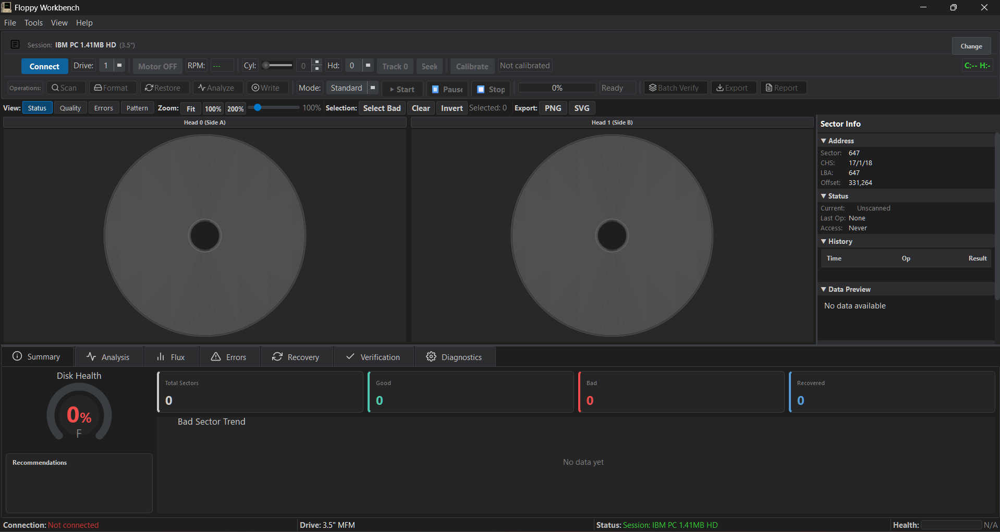
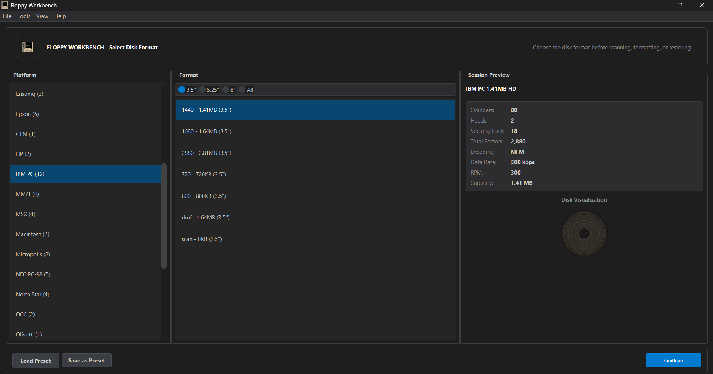
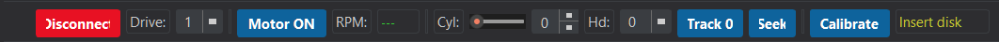
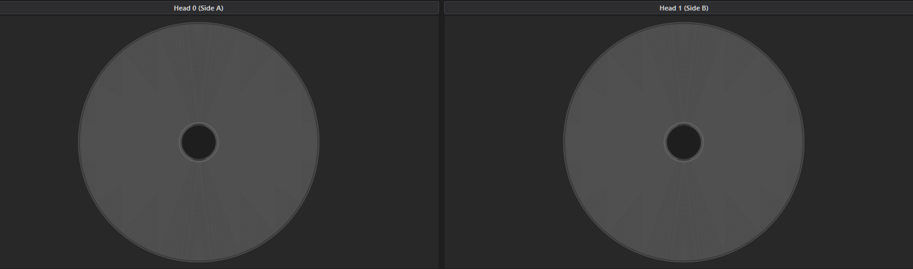
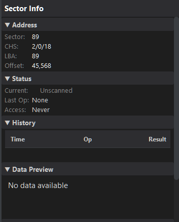
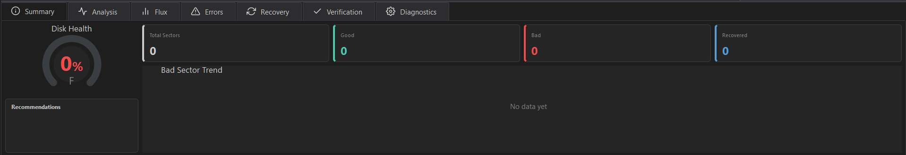

# User Interface Overview

This guide documents the complete Floppy Disk Workbench interface.

## Table of Contents

- [Main Window Layout](#main-window-layout)
- [Session Screen](#session-screen)
- [Drive Control Panel](#drive-control-panel)
- [Operation Toolbar](#operation-toolbar)
- [Circular Sector Map](#circular-sector-map)
- [Sector Info Panel](#sector-info-panel)
- [Analytics Panel](#analytics-panel)
- [Status Strip](#status-strip)
- [Menus](#menus)
- [Themes](#themes)

---

## Main Window Layout

Floppy Disk Workbench uses a three-panel architecture:

- **Top Panel**: Session indicator, drive controls, and operation toolbar
- **Center Panel**: Dual circular sector maps (one per head) with toolbar and sector info
- **Bottom Panel**: Tabbed analytics dashboard with eight analysis tabs

*Screenshot: Main window showing all three panels with a scanned disk*

---

## Session Screen

When you start Floppy Disk Workbench, the Session Screen appears. This screen lets you select the disk format before performing any operations.

### Components

**Platform Panel** (left side):
- Lists all supported platforms: IBM PC, Amiga, Atari ST, Macintosh, BBC Micro, Commodore, Apple II, and more
- Each platform has an icon for quick identification
- Click a platform to see its available formats

**Format Panel** (center):
- Shows all formats available for the selected platform
- Formats can be filtered by disk size (3.5" or 5.25")
- Displays key specifications: capacity, cylinders, heads, sectors per track, encoding

**Session Preview Panel** (right side):
- Visual disk representation showing geometry
- Complete format specifications
- Encoding type and bit cell timing

**Preset Management** (bottom):
- Load Preset: Recall previously saved session configurations
- Save Preset: Store the current session for future use
- Continue: Proceed to main workbench with selected format

*Screenshot: Session screen with IBM PC platform selected and 1.44MB HD format highlighted*

---

## Drive Control Panel

The Drive Control Panel occupies the top of the main window and provides hardware controls.

### Components

| Control | Function |
|---------|----------|
| **LED Indicator** | Green (connected), Red (disconnected), Yellow (connecting) |
| **Connect/Disconnect** | Toggle connection to Greaseweazle |
| **Drive Selector** | Choose Drive 0 or Drive 1 |
| **Motor On/Off** | Control spindle motor |
| **RPM Display** | Shows current drive speed (target: 300 RPM) |
| **Head Position** | Current cylinder with manual seek spinbox |
| **Calibrate** | Run drive alignment calibration |

### Connection States

| State | LED Color | Button Text |
|-------|-----------|-------------|
| Disconnected | Red | Connect |
| Connecting | Yellow | Connecting... |
| Connected | Green | Disconnect |
| Error | Red (flashing) | Connect |

### Keyboard Shortcuts

| Shortcut | Action |
|----------|--------|
| `Ctrl+Shift+C` | Connect/Disconnect |
| `Ctrl+M` | Toggle motor |
| `Ctrl+0` | Seek to track 0 |

*Screenshot: Drive control panel showing connected state with motor running at 300 RPM*

---

## Operation Toolbar

The Operation Toolbar provides access to all disk operations.

### Operation Buttons

| Button | Purpose | Shortcut |
|--------|---------|----------|
| **Scan** | Read disk surface and analyze sector health | `Ctrl+S` |
| **Format** | Write fresh format to disk (destructive) | `Ctrl+Shift+F` |
| **Restore** | Multi-pass recovery for damaged disks | `Ctrl+R` |
| **Analyze** | Comprehensive signal quality analysis | `Ctrl+Shift+A` |
| **Write Image** | Write blank disk image to physical disk | — |

### Mode Selector

Operations can run in different modes:

| Mode | Description |
|------|-------------|
| **Quick** | Sample tracks only (fast assessment) |
| **Standard** | Full single-pass operation |
| **Thorough** | Multi-pass with extended analysis |
| **Forensic** | Maximum effort, detailed logging |

### Progress Display

During operations, the toolbar shows:
- Current track and head being processed
- Progress bar with percentage
- Estimated time remaining
- Start/Stop/Pause buttons

*Screenshot: Operation toolbar with Scan button highlighted and mode selector visible*

---

## Circular Sector Map

The center of the interface displays dual circular sector maps—one for each head (side) of the disk. Each map visualizes all sectors on that side.

### Layout

- **Outer ring**: Track 0 (outer edge of disk)
- **Inner rings**: Higher track numbers toward center
- **Segments**: Each segment represents one sector
- **Head 0 Map**: Left circular display (top side)
- **Head 1 Map**: Right circular display (bottom side)

### Sector Colors

| Color | Status | Meaning |
|-------|--------|---------|
| **Gray** | UNSCANNED | Not yet read |
| **Green** | GOOD | Read successfully, CRC valid |
| **Red** | BAD | CRC error or unreadable |
| **Yellow-Orange** | WEAK | Marginal signal quality |
| **Light Green** | RECOVERED | Previously bad, now recovered |
| **Blue** | READING | Currently being read |
| **Purple** | WRITING | Currently being written |
| **Orange** | VERIFYING | Being verified |

### View Modes

The sector map toolbar offers four view modes:

| Mode | Display |
|------|---------|
| **Status** | Sector status (good/bad/weak/etc.) |
| **Quality** | Flux quality as color gradient |
| **Errors** | Highlight only errors, dim others |
| **Data Pattern** | Data pattern visualization |

### Interaction

- **Click sector**: Select and view details in Sector Info Panel
- **Right-click**: Context menu with sector options
- **Scroll wheel**: Zoom in/out
- **Drag**: Pan when zoomed
- **Select All Bad**: Toolbar button to select all bad sectors

### Sector Map Toolbar

| Button | Function |
|--------|----------|
| **View Mode Buttons** | Switch between STATUS/QUALITY/ERRORS/DATA_PATTERN |
| **Fit** | Fit entire map to view |
| **100%/200%** | Preset zoom levels |
| **Zoom Slider** | Custom zoom (50%–300%) |
| **Select All Bad** | Select all bad sectors |
| **Clear Selection** | Deselect all |
| **Export PNG** | Save map as PNG image |
| **Export SVG** | Save map as vector image |

*Screenshot: Dual sector maps showing a disk with some bad sectors (red) and weak sectors (yellow)*

---

## Sector Info Panel

The collapsible right-side panel shows detailed information about the selected sector.

### Displayed Information

**Address Information:**
- Sector number (1-based, standard PC numbering)
- CHS address (Cylinder/Head/Sector)
- LBA (Linear Block Address)
- Byte offset on disk

**Status:**
- Color-coded status indicator
- Current status (GOOD, BAD, WEAK, RECOVERED, etc.)
- Status history timeline showing changes over recovery passes

**Flux Quality Metrics:**
- Signal quality (0.0–1.0 scale)
- Timing jitter measurement
- Weak bit indicator

**Raw Data:**
- Hex dump showing first 64 bytes of sector
- Scrollable and selectable for copying

*Screenshot: Sector info panel showing details for a selected sector*

---

## Analytics Panel

The bottom panel contains a tabbed dashboard with eight analysis tabs.

### Summary Tab

Provides a high-level view of disk health:

- **Health Score Gauge**: 0–100 score with letter grade (A–F)
- **Statistics Cards**: Total sectors, good count, bad count, recovered count
- **Bad Sector Trend Chart**: Shows bad sector count over multiple operations
- **Recommendations**: Color-coded suggestions (INFO/WARNING/CRITICAL)

**Grading Scale:**
| Grade | Score | Status |
|-------|-------|--------|
| A | 90–100 | Excellent |
| B | 80–89 | Good |
| C | 70–79 | Fair |
| D | 60–69 | Poor |
| F | Below 60 | Failed |

*Screenshot: Summary tab showing health gauge and statistics cards*

### Analysis Tab

Detailed signal analysis:

- **Overall Grade**: Per-head quality breakdown
- **Track Grade Distribution**: Chart showing quality distribution across tracks
- **Signal Quality Metrics**: SNR, jitter, weak bit statistics
- **Encoding Detection**: Auto-detected format and encoding type
- **Copy Protection Status**: Indicates if protection schemes are detected
- **Recommendations**: Specific suggestions based on analysis

*Screenshot: Analysis tab showing track distribution and signal metrics*

### Flux Tab

Raw magnetic signal visualization:

- **Track/Sector Selector**: Choose specific location to analyze
- **Waveform Display**: Oscilloscope-style flux timing visualization
- **Histogram**: Pulse width distribution with MFM reference lines
- **Capture Controls**: Load saved flux or capture live from disk
- **Export Options**: Save flux data or visualization images

*Screenshot: Flux tab with waveform and histogram displays*

### Errors Tab

Error analysis and patterns:

- **Error Heatmap**: Visual cylinder-by-sector error distribution
- **Error Type Pie Chart**: Breakdown by error category
- **Error Log Table**: Detailed list with filtering options
- **Pattern Detection**: Identifies error clustering (radial scratches, track failures, etc.)

**Error Categories:**
| Type | Color | Description |
|------|-------|-------------|
| CRC | Red | Data CRC mismatch |
| Missing | Orange | Sector not found |
| Weak | Yellow | Marginal signal |
| No Address | Purple | Header not found |
| Header CRC | Brown | Header checksum error |
| Deleted | Blue | Deleted data mark |

*Screenshot: Errors tab showing heatmap and error type breakdown*

### Recovery Tab

Recovery operation monitoring:

- **Convergence Chart**: Line graph showing bad sector count per recovery pass
- **Pass History Table**: Pass-by-pass breakdown with recovery counts
- **Recovered Sectors Timeline**: When each sector was recovered
- **Recovery Prediction**: Estimates if additional passes will help

*Screenshot: Recovery tab with convergence graph and pass history*

### Diagnostics Tab

Drive health and testing:

- **Head Alignment Graph**: Track positioning accuracy visualization
- **RPM Stability Chart**: Spindle speed variation over time
- **Self-Test Results**: Motor, head positioning, and flux reading tests
- **Drive Information**: Model, firmware version, capabilities

*Screenshot: Diagnostics tab showing alignment graph and self-test results*

### Verification Tab

Post-operation verification results:

- **Overall Statistics**: Total/good/bad/weak sector counts
- **Per-Track Results Table**: Detailed breakdown by track
- **Grade Distribution Chart**: Visual grade breakdown

*Screenshot: Verification tab showing per-track results*

### Progress Tab

Real-time operation progress display (visible during active operations):

- **Circular Sector Map**: Live-updating visualization of sector status
- **Progress Bar**: Overall completion percentage
- **Sector Counter**: Current sector / total sectors (e.g., "1672 / 2880")
- **Good/Bad Counts**: Running tallies of sector status
- **Elapsed Time**: Time since operation started (MM:SS)
- **ETA**: Estimated time remaining
- **Cancel Button**: Stop the current operation

The Progress tab automatically becomes active when you start an operation (Scan, Format, Restore, etc.) and shows real-time updates as each track is processed.

*Screenshot: Progress tab showing scan operation in progress*

---

## Status Strip

The bottom status strip shows real-time application state.

### Four Sections

| Section | Content |
|---------|---------|
| **Connection** | Greaseweazle status and firmware version |
| **Drive** | Drive type, disk presence, current RPM |
| **Operation** | Current operation and progress percentage |
| **Health** | Color-coded disk health indicator |

### During Operations

The status strip updates to show:
- Operation name and progress percentage
- Current track being processed
- Estimated time remaining

*Screenshot: Status strip during a scan operation*

---

## Menus

### File Menu

| Item | Shortcut | Description |
|------|----------|-------------|
| New Session | `Ctrl+N` | Return to session screen to select new format |
| Load Session Preset | — | Load a saved session configuration |
| Save Session Preset | — | Save current session for future use |
| Exit | `Ctrl+Q` | Close application |

### Tools Menu

| Item | Description |
|------|-------------|
| Settings | Open application preferences dialog |

### View Menu

| Item | Shortcut | Description |
|------|----------|-------------|
| Toggle Dark Mode | `Ctrl+D` | Switch between dark and light themes |
| Full Screen | `F11` | Toggle fullscreen mode |

### Help Menu

| Item | Description |
|------|-------------|
| Documentation | Open wiki in web browser |
| About | Version information and credits |

---

## Themes

Floppy Disk Workbench supports dark and light themes.

### Dark Theme (Default)

- Dark gray background (#1e1e1e)
- High-contrast text
- Reduced eye strain for extended use
- Professional appearance

### Light Theme

- Light gray/white background
- Standard contrast
- Better for bright environments

### Changing Theme

**Method 1: Menu**
1. Open **View** menu
2. Select **Toggle Dark Mode**

**Method 2: Keyboard**
Press `Ctrl+D` to toggle between themes

**Method 3: Settings**
1. Open **Tools → Settings**
2. Navigate to Display tab
3. Select theme from dropdown

---

**Next:** [[Scanning Disks]] - Learn about scanning operations
